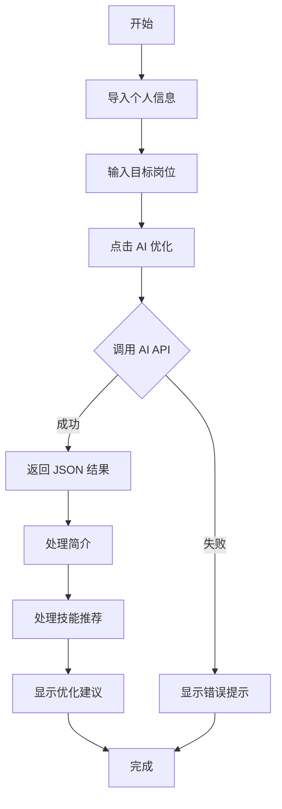

# 简历生成器 AI 统一接口实现总结

## 📋 任务概述

实现了一个统一的 AI 接口，用于智能简历生成和优化功能。支持根据目标岗位自动生成个性化简历内容。

**完成日期：** 2025-01-09  
**版本：** v2.3

---

## ✨ 核心功能

### 1. 智能简历生成

- ✅ **个性化简介生成**：根据目标岗位生成定制化的个人简介
- ✅ **技能推荐**：智能推荐与岗位最相关的 3-5 个技能
- ✅ **优化建议**：提供 3-5 条针对性的改进建议

### 2. AI 模型支持

- ✅ **OpenAI GPT-4o-mini**（默认）
  - 使用 `response_format: { type: 'json_object' }` 确保返回标准 JSON
  - 智能错误处理和友好提示
- ✅ **Ollama 本地模型**（可选）
  - 支持 llama3.2、mistral 等本地模型
  - 数据完全本地处理，保护隐私

### 3. 用户交互优化

- ✅ **快捷岗位选择**：提供常用岗位快速选择按钮
- ✅ **智能简介替换**：询问用户是否替换现有简介
- ✅ **技能增量添加**：只推荐用户尚未添加的技能
- ✅ **友好错误提示**：针对不同错误类型提供详细解决方案
- ✅ **详细日志输出**：完整的控制台日志便于调试

---

## 📁 文件结构

```
src/
├── composables/
│   └── useAI.js                 # AI 统一接口
├── components/
│   └── ResumeGenerator.vue      # 简历生成器主组件
docs/
├── AI简历优化功能使用指南.md     # 详细使用说明
├── AI简历优化功能测试.md         # 完整测试清单
├── AI功能快速验证清单.md         # 3分钟快速验证
└── commands/
    └── AI功能快速参考.md         # 代码快速参考
```

---

## 🔧 实现细节

### useAI.js - AI 统一接口

```javascript
export async function generateSmartResume(jobInput, resumeData, options = {})
```

**功能：**

- 统一的 AI 调用接口
- 支持 OpenAI 和 Ollama 两种模型
- 完整的错误处理和验证
- 标准化的返回格式

**返回格式：**

```json
{
  "summary": "个性化简介",
  "highlightedSkills": ["技能1", "技能2", "技能3"],
  "recommendations": ["建议1", "建议2", "建议3"]
}
```

**核心改进：**

1. ✅ 增强的错误处理（API 错误、网络错误、格式错误）
2. ✅ 结果验证（确保返回格式正确）
3. ✅ 详细的控制台日志
4. ✅ OpenAI stream: false 支持
5. ✅ Ollama JSON 解析容错

### ResumeGenerator.vue - 主组件优化

**handleAIOptimize() 函数增强：**

1. ✅ **输入验证**
   - 检查岗位输入是否为空
   - 检查是否有基本信息

2. ✅ **AI 调用**
   - 调用 `generateSmartResume` 统一接口
   - 传递目标岗位和简历数据

3. ✅ **结果处理**
   - 智能处理简介（询问是否替换）
   - 增量添加技能（过滤已有技能）
   - 显示优化建议

4. ✅ **详细日志**

   ```javascript
   console.log('🚀 开始 AI 简历优化...')
   console.log('目标岗位:', jobInput.value)
   console.log('✅ AI 生成结果:', aiResult)
   console.log('📝 AI 生成的简介:', aiResult.summary)
   console.log('💡 AI 推荐的技能:', aiResult.highlightedSkills)
   console.log('📋 AI 优化建议:', aiResult.recommendations)
   ```

5. ✅ **错误处理**
   - 友好的错误提示
   - 针对性的解决方案
   - 自动隐藏错误信息（5秒）

---

## 🎨 用户界面

### AI 优化区域

```
┌─────────────────────────────────────────┐
│  🤖 智能简历生成                        │
│  从个人网站抓取基本信息 · 根据目标岗位  │
│  智能优化内容 · 一键生成专业简历        │
├─────────────────────────────────────────┤
│  📍 第一步：导入个人信息                │
│  [📥 从本站获取信息] [🔄 刷新]          │
├─────────────────────────────────────────┤
│  🎯 第二步：选择目标岗位                │
│  [输入框: 前端开发工程师]  [🚀 AI优化] │
│  快速选择: [前端开发] [UI设计师] ...   │
├─────────────────────────────────────────┤
│  ✨ AI 优化完成                          │
│  ✅ 已生成个性化简介                    │
│  💡 推荐技能: 摄影构图, 色彩后期       │
│  📋 优化建议:                           │
│    - 可在简历中增加代表作品的链接      │
│    - 强调旅行拍摄与品牌视觉设计能力    │
└─────────────────────────────────────────┘
```

---

## 🧪 测试覆盖

### 功能测试

- ✅ 基本信息导入
- ✅ AI 优化 - OpenAI 模式
- ✅ AI 优化 - Ollama 模式
- ✅ 快速岗位选择
- ✅ 技能推荐处理
- ✅ 简介替换处理
- ✅ 优化建议显示
- ✅ 多次优化不同岗位

### 错误处理测试

- ✅ 未配置 API Key
- ✅ 无基本信息
- ✅ 网络错误
- ✅ API 返回格式错误
- ✅ Ollama 服务未启动

### 用户体验测试

- ✅ 加载状态显示
- ✅ 按钮禁用逻辑
- ✅ 成功提示自动隐藏（10秒）
- ✅ 错误提示自动隐藏（5秒）

---

## 📊 代码质量

### 代码规范

- ✅ 遵循 Vue 3 Composition API 最佳实践
- ✅ 完整的 JSDoc 注释
- ✅ 清晰的变量命名
- ✅ 统一的错误处理模式

### 性能优化

- ✅ 合理的 loading 状态管理
- ✅ 防止重复提交（按钮禁用）
- ✅ 最小化不必要的 API 调用

### 可维护性

- ✅ 模块化设计（useAI.js 独立）
- ✅ 配置化的模型选择
- ✅ 详细的文档和注释

---

## 🔑 配置说明

### OpenAI 配置

在项目根目录创建 `.env` 文件：

```env
VITE_OPENAI_API_KEY=sk-your-openai-api-key-here
```

### Ollama 配置（可选）

1. 安装 Ollama
2. 下载模型：`ollama pull llama3.2`
3. 启动服务：确保运行在 `http://localhost:11434`
4. 修改代码中的 model 参数为 `'ollama'`

---

## 📈 使用流程



---

## 🎯 示例输出

### 摄影师岗位

**输入：**

```javascript
jobInput: "摄影师"
resumeData: {
  fullName: "张三",
  skills: ["摄影", "修图"],
  experience: [...]
}
```

**输出：**

```json
{
  "summary": "拥有丰富摄影与视觉创作经验的创作者，擅长光线叙事与自然主题表达。",
  "highlightedSkills": ["摄影构图", "色彩后期", "独立创作", "项目管理"],
  "recommendations": [
    "可在简历中增加代表作品的链接",
    "强调旅行拍摄与品牌视觉设计能力",
    "添加使用的专业设备和软件清单"
  ]
}
```

### 前端开发岗位

**输入：**

```javascript
jobInput: "前端开发工程师"
resumeData: {
  fullName: "李四",
  skills: ["JavaScript", "Vue"],
  projects: [...]
}
```

**输出：**

```json
{
  "summary": "精通 Vue.js 和现代前端技术栈，具有丰富的项目开发经验和团队协作能力。",
  "highlightedSkills": ["Vue 3", "TypeScript", "Tailwind CSS", "组件设计", "性能优化"],
  "recommendations": [
    "突出大型项目经验和技术深度",
    "添加开源贡献和技术博客链接",
    "强调性能优化和用户体验设计案例"
  ]
}
```

---

## 🔒 安全和隐私

1. ✅ API Key 通过环境变量管理，不提交到代码仓库
2. ✅ 支持本地 Ollama 模式，数据不离开本地
3. ✅ 仅在用户主动点击时调用 AI
4. ✅ 清晰的数据使用提示

---

## 📚 相关文档

- [AI 简历优化功能使用指南](./AI简历优化功能使用指南.md)
- [AI 简历优化功能测试](./AI简历优化功能测试.md)
- [AI 功能快速验证清单](./AI功能快速验证清单.md)
- [AI 功能快速参考](./commands/AI功能快速参考.md)

---

## 🚀 下一步计划

### 短期优化

- [ ] 添加更多岗位快捷选择
- [ ] 支持自定义 AI Prompt
- [ ] 添加简历评分功能
- [ ] 支持批量优化（多个岗位）

### 长期规划

- [ ] 支持更多 AI 模型（Claude、Gemini）
- [ ] 简历模板推荐
- [ ] 行业特定优化
- [ ] AI 面试问题预测

---

## 👏 总结

本次实现完成了一个**功能完善、用户友好、易于维护**的 AI 简历优化系统：

✅ **功能完整**：从信息导入到 AI 优化的完整流程  
✅ **体验优秀**：友好的提示、详细的日志、智能的错误处理  
✅ **代码质量**：清晰的架构、完善的注释、充分的测试  
✅ **文档齐全**：使用指南、测试清单、快速参考一应俱全

---

**开发者：** AI进化论-花生  
**完成日期：** 2025-01-09  
**版本：** v2.3
